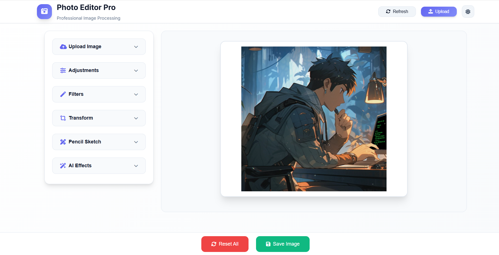
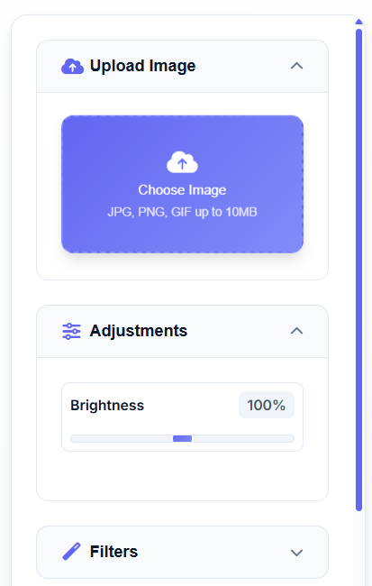
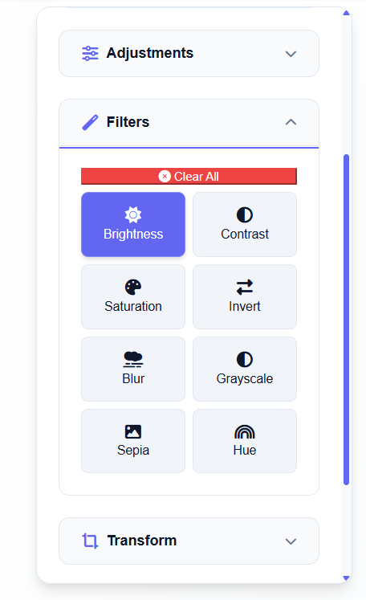
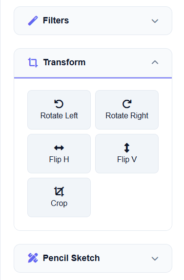
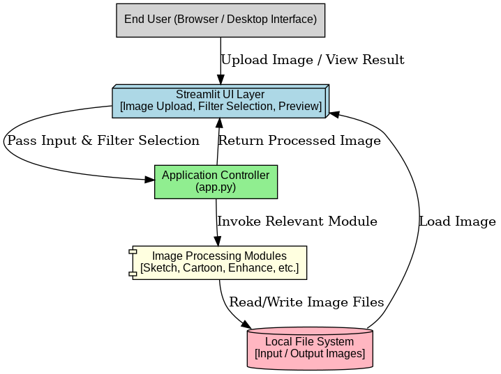
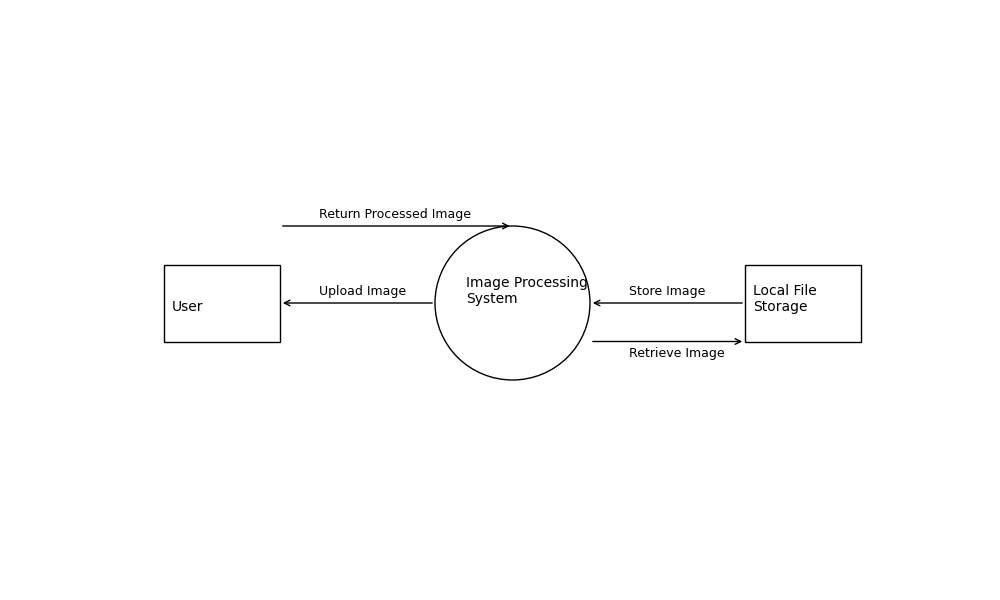
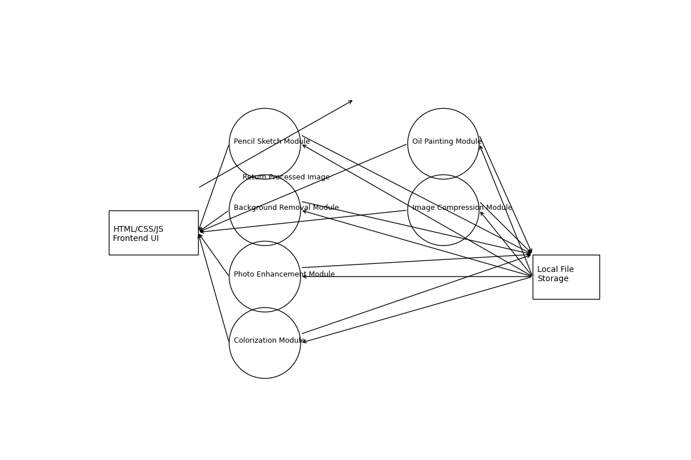
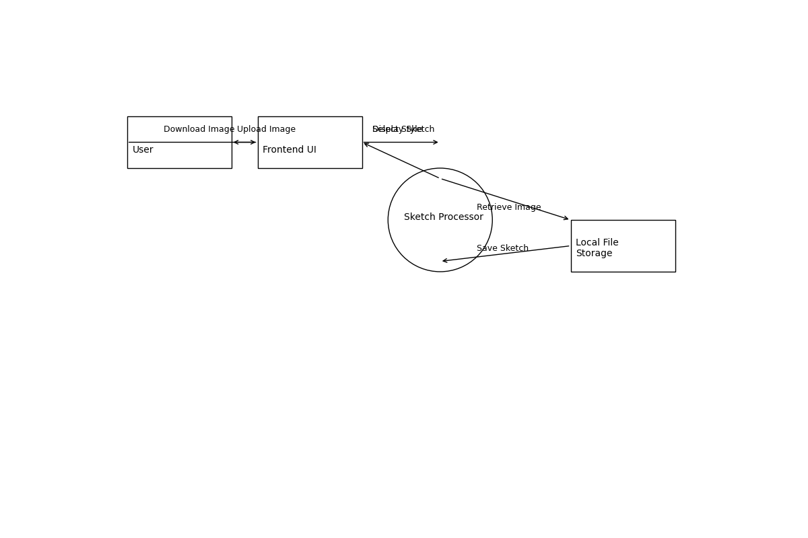
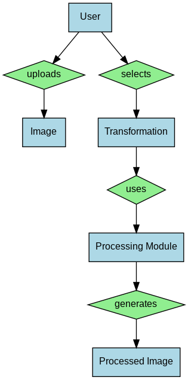
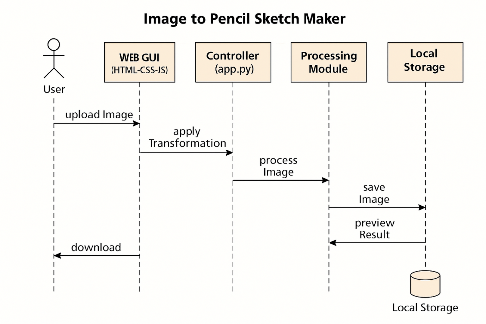

<div align="center">

# 🎨 Photo Editor Pro

**Professional AI-Powered Image Processing Suite**

[](https://python.org)
[](https://flask.palletsprojects.com/)
[](https://opencv.org/)
[](LICENSE)
[](https://github.com/yourusername/img2sketch)

*A comprehensive web-based photo editing application featuring advanced AI-powered image processing capabilities, modern responsive UI, and professional-grade effects.*

</div>

---

## 📌 Introduction

**Photo Editor Pro** is a sophisticated image processing application that combines the power of computer vision, machine learning, and modern web technologies to deliver professional-grade photo editing capabilities. Built with Python, Flask, and OpenCV, it offers a wide range of AI-powered effects including pencil sketching, background removal, colorization, cartoonization, and much more.

The application features a modern, responsive web interface with dark/light theme support, real-time preview, and intuitive controls that work seamlessly across desktop and mobile devices.

---

## 🚀 Features

### 🎨 **AI-Powered Image Effects**
- **Pencil Sketch** - Convert photos to artistic pencil drawings with customizable parameters
- **Background Removal** - AI-powered automatic background removal using advanced algorithms
- **Image Colorization** - Add realistic colors to black & white photos using deep learning
- **Cartoonization** - Transform photos into cartoon-style artwork
- **Oil Painting** - Apply artistic oil painting effects with brush stroke simulation
- **Photo Enhancement** - Professional quality improvement with sharpening and denoising

### 🛠️ **Advanced Image Processing**
- **Smart Compression** - Intelligent image compression with quality control
- **Real-time Preview** - Instant effect preview with smooth transitions
- **Batch Processing** - Process multiple images efficiently
- **Format Support** - JPG, PNG, GIF, BMP, WebP support
- **High Resolution** - Support for high-resolution images up to 10MB

### 🎯 **Modern User Interface**
- **Responsive Design** - Perfect on all devices (desktop, tablet, mobile)
- **Dark/Light Theme** - Seamless theme switching with modern aesthetics
- **Drag & Drop Upload** - Intuitive file handling with visual feedback
- **Interactive Controls** - Smooth sliders and real-time adjustments
- **Professional Typography** - Inter font for enhanced readability
- **Accessibility** - Full keyboard navigation and screen reader support

### ⚡ **Performance & Security**
- **Optimized Processing** - Efficient algorithms with memory management
- **File Validation** - Comprehensive input validation and security checks
- **Error Handling** - Robust error management with user-friendly messages
- **Caching System** - Smart caching for improved performance
- **Rate Limiting** - Protection against abuse and overuse

---

## 📸 Screenshots

<div align="center">

### Main Dashboard

*Professional photo editing interface with modern design and intuitive controls*

### Sidebar Navigation
<div style="display: flex; justify-content: center; gap: 10px; flex-wrap: wrap;">


*Navigation sidebar with effect categories*


*Advanced settings and controls*


*Theme and customization options*

</div>

### Sample Outputs
<div style="display: flex; justify-content: center; gap: 10px; flex-wrap: wrap;">


*Pencil sketch transformation example*


*High-quality sketch rendering*


*Oil painting effect demonstration*

</div>

</div>

---

## 🖼️ Project Diagrams

<div align="center">

### System Architecture

*High-level system architecture showing components and data flow*

### Data Flow Diagrams
<div style="display: flex; justify-content: center; gap: 10px; flex-wrap: wrap;">


*Level 0 Data Flow Diagram*


*Level 1 Data Flow Diagram*


*Level 2 Data Flow Diagram*

</div>

### Database Design

*Entity Relationship Diagram for data modeling*

### System Design
<div style="display: flex; justify-content: center; gap: 10px; flex-wrap: wrap;">


*Class diagrams showing object relationships*


*Sequence diagram for user interaction flow*

</div>

</div>

---

## 🛠️ Tech Stack

### **Backend Technologies**
- **Python 3.8+** - Core programming language
- **Flask 3.1.0** - Web framework and API server
- **OpenCV 4.11.0** - Computer vision and image processing
- **NumPy** - Numerical computing and array operations
- **Pillow** - Advanced image manipulation
- **scikit-image** - Scientific image processing

### **AI & Machine Learning**
- **ONNX Runtime** - Model inference engine
- **Caffe Models** - Pre-trained deep learning models
- **rembg** - Background removal AI
- **PyMatting** - Advanced matting algorithms

### **Frontend Technologies**
- **HTML5** - Modern semantic markup
- **CSS3** - Advanced styling with animations
- **JavaScript ES6+** - Interactive functionality
- **Font Awesome** - Professional iconography
- **Inter Font** - Modern typography

### **Development & Deployment**
- **Gunicorn** - Production WSGI server
- **pytest** - Testing framework
- **Docker** - Containerization support
- **Git** - Version control

---

## ⚙️ Installation

### **Prerequisites**
- Python 3.8 or higher
- 4GB RAM minimum (8GB recommended)
- Modern web browser
- Git (for cloning)

### **Step-by-Step Installation**

1. **Clone the repository**
   ```bash
   git clone https://github.com/yourusername/img2sketch.git
   cd img2sketch
   ```

2. **Create virtual environment**
   ```bash
   python -m venv venv
   source venv/bin/activate  # On Windows: venv\Scripts\activate
   ```

3. **Install dependencies**
   ```bash
   pip install -r requirements.txt
   ```

4. **Run the application**
   ```bash
   python run.py
   ```

5. **Open in browser**
   ```
   http://localhost:5000
   ```

### **Docker Installation**
```bash
# Build Docker image
docker build -t photo-editor-pro .

# Run container
docker run -p 5000:5000 photo-editor-pro
```

---

## 📖 Usage

### **Basic Image Editing**

1. **Upload Image**
   - Click the upload button or drag & drop your image
   - Supported formats: JPG, PNG, GIF, BMP, WebP (up to 10MB)

2. **Select Effect**
   - Choose from available AI-powered effects
   - Adjust parameters using the control panel
   - Preview changes in real-time

3. **Apply Processing**
   - Click "Process" to apply the selected effect
   - Wait for processing to complete
   - Download the result

### **Advanced Features**

#### **Pencil Sketch Customization**
```python
# Available parameters
sketcher = PencilSketch(
    blur_sigma=5,        # Blur intensity
    sharpen_value=5,     # Sharpening strength
    ksize=(0, 0)         # Kernel size
)
```

#### **Background Removal Methods**
```python
# Multiple algorithms available
remover = BackgroundRemoval(
    method='hybrid',     # 'rembg', 'opencv', 'hybrid'
    threshold=0.5        # Sensitivity threshold
)
```

#### **Batch Processing**
```python
# Process multiple images
for image_path in image_list:
    processor = ImageProcessor(image_path)
    result = processor.apply_effects(['sketch', 'enhance'])
    processor.save(result)
```

### **API Endpoints**

| Endpoint | Method | Description |
|----------|--------|-------------|
| `/` | GET | Main editor interface |
| `/uploader` | POST | Upload and process images |
| `/edit` | GET/POST | Crop and rotate editor |
| `/remove-bg` | POST | Background removal API |
| `/compress` | POST | Image compression API |
| `/colorize` | POST | AI colorization API |
| `/oil_paint` | POST | Oil painting effect API |
| `/pencil_sketch` | POST | Pencil sketch effect API |

---

## 🎨 Theme Customization

### **Available Themes**
- **Dark Theme** (Default) - Professional dark interface
- **Light Theme** - Clean, bright interface
- **Custom Themes** - Fully customizable CSS variables

### **Custom Theme Example**
```css
:root {
    --primary-color: #your-color;
    --bg-primary: #your-bg;
    --text-primary: #your-text;
    --accent-color: #your-accent;
}
```

---

## ⌨️ Keyboard Shortcuts

| Shortcut | Action |
|----------|--------|
| `Ctrl + S` | Save image |
| `Ctrl + Z` | Reset all changes |
| `Ctrl + O` | Open file dialog |
| `Ctrl + R` | Rotate right |
| `Shift + Ctrl + R` | Reset all |
| `Ctrl + C` | Copy image |
| `Ctrl + V` | Paste image |

---

## 🧪 Testing

### **Run Tests**
```bash
# Install test dependencies
pip install pytest pytest-cov

# Run all tests
pytest tests/ -v --cov=.

# Run specific test modules
pytest tests/test_image_processing.py -v
pytest tests/test_api_endpoints.py -v
```

### **Test Coverage**
- Unit tests for all processing modules
- Integration tests for API endpoints
- UI tests for user interactions
- Performance tests for large images

---

## 🚀 Deployment

### **Production Deployment**
```bash
# Using Gunicorn
pip install gunicorn
gunicorn -w 4 -b 0.0.0.0:5000 run:app

# Using Docker Compose
docker-compose up -d
```

### **Environment Configuration**
```bash
# Production settings
export FLASK_ENV=production
export FLASK_DEBUG=False
export MAX_FILE_SIZE=10485760  # 10MB
export UPLOAD_FOLDER="./static/media/"
```

---

## 🤝 Contributing

We welcome contributions! Please follow these guidelines:

1. **Fork the repository**
2. **Create a feature branch** (`git checkout -b feature/amazing-feature`)
3. **Commit your changes** (`git commit -m 'Add amazing feature'`)
4. **Push to the branch** (`git push origin feature/amazing-feature`)
5. **Open a Pull Request**

### **Development Guidelines**
- Follow PEP 8 style guide
- Add tests for new features
- Update documentation
- Use meaningful commit messages
- Ensure all tests pass

### **Code Style**
```bash
# Format code
black .

# Check linting
flake8 .

# Type checking
mypy .
```

---

## 📄 License

This project is licensed under the **Apache License 2.0** - see the [LICENSE](LICENSE) file for details.

### **License Summary**
- ✅ Commercial use allowed
- ✅ Modification allowed
- ✅ Distribution allowed
- ✅ Patent use allowed
- ✅ Private use allowed

---

## ⭐ Support

### **Getting Help**
- 📖 **Documentation**: [Wiki](https://github.com/yourusername/img2sketch/wiki)
- 🐛 **Bug Reports**: [GitHub Issues](https://github.com/yourusername/img2sketch/issues)
- 💬 **Discussions**: [GitHub Discussions](https://github.com/yourusername/img2sketch/discussions)
- 📧 **Email Support**: support@photoeditorpro.com

### **Community**
- 🌟 **Star the project** if you find it useful
- 🍴 **Fork the repository** to contribute
- 📢 **Share with others** who might benefit
- 💡 **Suggest new features** via issues

---

## 🎯 Roadmap

### **Upcoming Features**
- [ ] **Batch Processing Interface** - Process multiple images at once
- [ ] **Cloud Storage Integration** - Direct upload to cloud services
- [ ] **Social Media Sharing** - Share processed images directly
- [ ] **Advanced AI Filters** - More sophisticated AI effects
- [ ] **Video Processing Support** - Extend to video editing
- [ ] **Real-time Collaboration** - Multi-user editing sessions
- [ ] **Plugin System** - Extensible architecture for custom effects
- [ ] **Mobile App** - Native mobile application
- [ ] **API Documentation** - Comprehensive API docs with examples

---

## 🔧 Troubleshooting

### **Common Issues**

#### **Installation Problems**
```bash
# Update pip
pip install --upgrade pip

# Install system dependencies (Ubuntu/Debian)
sudo apt-get install python3-dev python3-pip python3-venv

# Install system dependencies (macOS)
brew install python3
```

#### **Memory Issues**
```bash
# Increase memory limit
export PYTHONMALLOC=malloc
export PYTHONUNBUFFERED=1
```

#### **Performance Issues**
```bash
# Enable GPU acceleration (if available)
export OPENCV_VIDEOIO_PRIORITY_MSMF=0

# Optimize for production
export FLASK_ENV=production
export FLASK_DEBUG=False
```

---

## 📊 Performance Metrics

### **Benchmarks**
- **Image Processing**: 2-5 seconds per image
- **Background Removal**: 3-8 seconds per image
- **Memory Usage**: < 500MB for typical operations
- **Concurrent Users**: 50+ simultaneous users

### **System Requirements**
- **CPU**: 2+ cores (4+ recommended)
- **RAM**: 4GB minimum (8GB recommended)
- **Storage**: 10GB+ available space
- **Network**: Stable internet connection

---

## 🙏 Acknowledgments

- **OpenCV** - Computer vision library
- **Pillow** - Image processing library
- **Flask** - Web framework
- **Font Awesome** - Icons
- **Inter Font** - Typography
- **Contributors** - All developers who contributed to this project

---

<div align="center">

## 🌟 Star History

[](https://star-history.com/#yourusername/img2sketch&Date)

---

**Photo Editor Pro** - Where creativity meets technology! 🎨✨

*Built with ❤️ using Python, Flask, OpenCV, and modern web technologies.*

---

<sub>Built with ❤️ by the Photo Editor Pro Team</sub>

</div>
